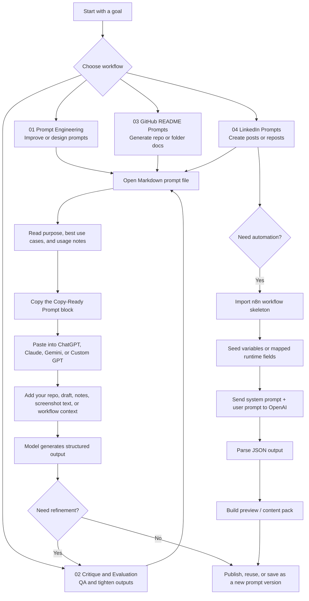

# Prompt Library

> **Created by** [Abdul Rehman](https://www.linkedin.com/in/abdul4rehman215) · [GitHub @abdul4rehman215](https://github.com/abdul4rehman215) &nbsp;|&nbsp; [Muhammad Saad Khan](https://www.linkedin.com/in/msk0442) · [GitHub @msk0442](https://github.com/msk0442)


> **Suggested hero asset:** A 12–18 second cinematic GIF recorded in dark mode that shows: opening the repository, selecting a workflow folder, copying a prompt block, pasting it into an LLM, and optionally running the `n8n` workflow to produce a structured output preview.

## Why this repository exists

Most prompt collections fail for the same reason codebases do: they start useful, then slowly turn into a graveyard of unnamed files, half-tested variations, and prompts nobody trusts enough to reuse.

This repository exists to solve that exact problem.

Instead of treating prompts like disposable chat fragments, **Prompt Library** organizes them into repeatable workflows with:

- short folder-level READMEs
- copy-ready prompt blocks
- usage notes and expected outputs
- personalization guidance for identity-based prompts
- optional `n8n` automation assets for production-style workflows

In plain terms: **the problem is prompt chaos; the solution is a reusable, workflow-first prompt system.**

## Table of Contents

- [Why this repository exists](#why-this-repository-exists)
- [How it works](#how-it-works)
- [Repository structure](#repository-structure)
- [Who this repository is for](#who-this-repository-is-for)
- [Zero-to-Hero setup](#zero-to-hero-setup)
- [Configuration](#configuration)
- [Usage guide](#usage-guide)
- [Deep-dive: core logic and main features](#deep-dive-core-logic-and-main-features)
- [Troubleshooting and FAQ](#troubleshooting-and-faq)
- [Maintainer notes](#maintainer-notes)
- [Contributors](#contributors)
- [License](#license)

## How it works

At a high level, this repo gives you two ways to work:

1. **Manual mode** — open a Markdown file, copy the prompt block, paste it into your model of choice, and provide your source material.
2. **Automation mode** — import the included `n8n` workflow skeletons, inject variables, call an OpenAI model, and parse structured output for downstream use.



## Repository structure

This repository is mostly Markdown by design: **35 Markdown files** and **2 JSON workflow skeletons** organized into four workflow-driven modules.

```text
PROMPT-LIBRARY-main/
├── README.md
├── PERSONALIZATION-GUIDE.md
├── 01-prompt-engineering/
│   ├── README.md
│   └── ai-prompt-engineer-chat.md
├── 02-critique-and-evaluation/
│   ├── README.md
│   └── critique-prime-evaluator.md
├── 03-github-readme-prompts/
│   ├── README.md
│   ├── folder-readme/
│   │   ├── README.md
│   │   └── github-folder-readme-maker.md
│   └── repo-main-readme/
│       ├── README.md
│       └── github-main-readme-maker.md
└── 04-linkedin-prompts/
    ├── README.md
    ├── post-strategist/
    │   ├── README.md
    │   ├── linkedin-content-strategist-auto-mode.md
    │   ├── linkedin-content-strategist.md
    │   ├── linkedin-post-custom-gpt-production.md
    │   ├── linkedin-post-editable-base.md
    │   ├── linkedin-post-image-prompt-maker.md
    │   ├── linkedin-post-recruiter-facing.md
    │   ├── repo-to-linkedin-post.md
    │   └── n8n/
    │       ├── README.md
    │       ├── system-prompt.md
    │       ├── user-prompt-template.md
    │       └── workflow-skeleton.json
    └── repost-strategist/
        ├── README.md
        ├── linkedin-repost-custom-gpt-production.md
        ├── linkedin-repost-editable-base.md
        ├── linkedin-repost-v1.md
        ├── linkedin-repost-v2.md
        ├── linkedin-repost-v3-authority.md
        ├── linkedin-repost-v4-conversion.md
        ├── linkedin-repost-v5-elite-client.md
        ├── linkedin-repost-v6-hybrid-master.md
        └── n8n/
            ├── README.md
            ├── system-prompt.md
            ├── user-prompt-template.md
            └── workflow-skeleton.json
```

### Module map

| Module | What it does | Best for |
|---|---|---|
| `01-prompt-engineering` | Improves weak or vague prompts | Prompt builders and AI power users |
| `02-critique-and-evaluation` | Reviews outputs against a stricter quality bar | QA passes before publishing |
| `03-github-readme-prompts` | Generates top-level and folder-level READMEs | Open-source repos, portfolios, DX docs |
| `04-linkedin-prompts` | Creates LinkedIn posts, reposts, and optional automated content pipelines | Technical creators, job seekers, DevRel-style positioning |
| `PERSONALIZATION-GUIDE.md` | Helps adapt identity-based prompts for another person | Reuse without leaking old names or proof signals |

## Who this repository is for

This repo is best suited for:

- **AI builders** who want reusable prompt assets instead of one-off chats
- **Technical creators** who publish documentation, README files, or LinkedIn content
- **Cybersecurity practitioners** building public proof-of-work and authority content
- **DevRel-minded developers** who care about repeatability, clarity, and audience fit
- **Recruiters and reviewers** who want to quickly understand the quality of the author’s workflow thinking

## Zero-to-Hero setup

The good news: **you do not need to install a runtime to start using this repo manually.**

You only need Git and a way to open Markdown files.

### Path A — fastest start (manual use)

1. **Install Git** if it is not already available on your machine.
2. **Clone the repository.**
3. **Open the repository in your editor** or directly in GitHub.
4. **Pick the folder that matches your task.**
5. **Open the prompt file and copy the `Copy-Ready Prompt` block.**
6. **Paste the prompt into your LLM** and add your real context below it.
7. **Save strong variants as new files** instead of overwriting the original master prompt.

```bash
git clone https://github.com/<your-username>/PROMPT-LIBRARY-main.git
cd PROMPT-LIBRARY-main
```

Optional, if you use VS Code:

```bash
code .
```

### Path B — optional automation with n8n

Use this only if you want repeatable LinkedIn content generation through `n8n`.

1. Clone the repository.
2. Open `04-linkedin-prompts/post-strategist/n8n/` or `04-linkedin-prompts/repost-strategist/n8n/`.
3. Import `workflow-skeleton.json` into `n8n`.
4. Paste the matching `system-prompt.md` and `user-prompt-template.md` into your AI nodes if you are rebuilding or extending the workflow.
5. Configure your OpenAI credentials.
6. Run a manual test with safe sample content before publishing anything.

> **Pro tip:** Start with the manual prompt first. Once the output is consistently strong, automate it. That sequence prevents you from automating a weak prompt.

### Recommended prerequisites

| Requirement | Needed for | Notes |
|---|---|---|
| Git | Cloning the repo | Required |
| Markdown viewer or code editor | Reading prompt files | VS Code, GitHub UI, Obsidian, Typora, etc. |
| LLM account | Running prompts manually | ChatGPT, Claude, Gemini, or a Custom GPT |
| n8n | Optional workflow automation | Only needed for the `04-linkedin-prompts/*/n8n` assets |
| OpenAI access | Optional `n8n` automation | Used in the included workflow skeletons |

## Configuration

### `.env` variables

For **manual use**, no `.env` file is required.

For **optional automation**, the repository directly references the following variable in the post-generation `n8n` workflow:

| Variable | Required | Used by | Example | Purpose |
|---|---:|---|---|---|
| `OPENAI_API_KEY` | Only for optional automation | `04-linkedin-prompts/post-strategist/n8n/workflow-skeleton.json` | `sk-...` | Authenticates the HTTP request to the OpenAI Chat Completions API |

Example local export for self-hosted or shell-driven environments:

```bash
export OPENAI_API_KEY="sk-your-key-here"
```

If you prefer a local `.env` file for your own setup, create one yourself:

```bash
printf 'OPENAI_API_KEY=sk-your-key-here\n' > .env
```

> **Pro tip:** The repost workflow uses an `n8n` OpenAI model node, so credentials may live in the `n8n` UI rather than in a local `.env` file.

## Usage guide

### 1. Improve or create a prompt

Open:

- `01-prompt-engineering/ai-prompt-engineer-chat.md`

Use it when you have a weak prompt, a vague workflow, or an idea that needs structure.

### 2. Critique an output before publishing

Open:

- `02-critique-and-evaluation/critique-prime-evaluator.md`

Use it after generation when you want a second-pass QA layer.

### 3. Generate repository documentation

Open one of these:

- `03-github-readme-prompts/repo-main-readme/github-main-readme-maker.md`
- `03-github-readme-prompts/folder-readme/github-folder-readme-maker.md`

Use the first for a whole repository and the second for one module or subfolder.

### 4. Turn technical work into LinkedIn content

Open one of these:

- `04-linkedin-prompts/post-strategist/linkedin-content-strategist-auto-mode.md`
- `04-linkedin-prompts/post-strategist/repo-to-linkedin-post.md`
- `04-linkedin-prompts/repost-strategist/linkedin-repost-v6-hybrid-master.md`

Use `post-strategist` for original content and `repost-strategist` when reacting to someone else’s post with your own technical angle.

### 5. Personalize prompts for another person

Open:

- `PERSONALIZATION-GUIDE.md`

Use it before reusing any identity-specific prompt so names, claims, tools, and proof signals are updated cleanly.

## Deep-dive: core logic and main features

### 1. Each prompt file is self-documenting

The repo does not just store prompts. It wraps each one with context so a future user knows **when** and **how** to use it.

```md
## Purpose
A repository-level README generator focused on producing a strong top-level project README.

## Best Use Cases
- Creating a polished README for a full repository
- Explaining project purpose, setup, features, and usage
```

**Plain English:** every prompt file doubles as a mini playbook. You do not have to guess what the prompt is for.

### 2. The README prompts enforce structured thinking

The main repository README prompt does not ask for generic fluff. It asks for a specific documentation system: hero section, architecture, setup, configuration, deep-dive logic, and support-oriented FAQ.

```text
1. The "Billion-Dollar" Hero Section
2. Visual Architecture & Logic
3. "Grandma-Proof" Zero-to-Hero Installation
4. Deep-Dive Code Explanation & Usage
5. Troubleshooting & FAQ
```

**Plain English:** this is why the README outputs are more useful than a typical AI-generated intro paragraph. The prompt forces full-stack documentation thinking.

> **Pro tip:** Use the repo-level README prompt first, then run the critique prompt on the result. That combination gives you generation plus QA.

### 3. The post-generation `n8n` workflow is JSON-first

The `post-strategist` workflow does not trust free-form prose. It explicitly requests a JSON object from the model and then flattens the result into reusable fields.

```json
{
  "model": "gpt-5-mini",
  "response_format": { "type": "json_object" },
  "temperature": 0.7
}
```

**Plain English:** the workflow is designed for machines as much as humans. Structured outputs are easier to preview, store, validate, and reuse.

The same workflow also includes a fallback parser step:

```js
try {
  parsed = JSON.parse(content);
} catch (error) {
  parsed = { selected_mode: 'Mode C: General Authority Post', ... };
}
```

**Plain English:** if the model returns messy output, the workflow fails more gracefully instead of collapsing immediately.

### 4. The repost workflow is stricter about schema control

The repost `n8n` workflow uses a structured output parser and a richer schema with hooks, reframes, first-hour comment boosters, and audience strategy.

```json
{
  "strategic_reframe": "",
  "hook_options": {
    "analytical": "",
    "contrarian": "",
    "practical_value": ""
  },
  "first_hour_comment_boosters": ["", "", ""]
}
```

**Plain English:** reposting here is treated like a content system, not an improvised comment. The workflow expects reusable building blocks.

### 5. Personalization is treated as an explicit workflow

Identity-based prompts are easy to reuse badly. This repo avoids that by including a dedicated guide.

```md
## Replace These First
- Name, location, and current role
- Years of experience and proof signals
- Core strengths, niche, and tools
```

**Plain English:** before you reuse a personal prompt, update the identity layer first. That reduces accidental carryover of old names, claims, or positioning.

## Troubleshooting and FAQ

### 1. `git: command not found`

**Cause:** Git is not installed or not available in your shell path.

**Fix:** install Git, restart your terminal, and verify it works.

```bash
git --version
```

If that command still fails, reinstall Git and make sure your installer adds Git to your system path.

### 2. The prompt output feels generic or too hype-heavy

**Cause:** you pasted the prompt, but not enough real source material.

**Fix:** provide richer inputs such as:

- the actual repo tree
- a real README or architecture summary
- project goals
- screenshots or workflow notes
- target audience and constraints

The prompts in this repo perform best when fed with concrete context, not one-line requests.

### 3. The `n8n` workflow returns a 401 or authentication error

**Cause:** your OpenAI credentials are missing, invalid, or not wired into the node correctly.

**Fix:** confirm your key exists and is readable where the workflow expects it.

```bash
echo "$OPENAI_API_KEY"
```

If nothing prints, set the variable again or configure credentials directly inside `n8n`.

### 4. The model output is not valid JSON

**Cause:** the model ignored part of the format contract, or the prompt was modified carelessly.

**Fix:**

1. Keep the original system prompt structure intact.
2. Keep `Return JSON only` style instructions intact.
3. Lower temperature slightly if your workflow is too creative.
4. Test with smaller, cleaner input first.

The included post workflow already contains a fallback parser. The repost workflow is stricter and benefits from keeping the schema untouched.

### 5. Imported `n8n` workflow runs, but the preview fields are empty

**Cause:** upstream variable names do not match the placeholders expected by the workflow.

**Fix:** compare your field names against the JSON skeleton and align them exactly. In particular, verify fields like:

- `raw_context`
- `optional_goal`
- `project_title`
- `project_stack`
- `source_content`

### 6. Mermaid diagrams do not render on GitHub

**Cause:** the fenced block is malformed.

**Fix:** make sure the block starts with exactly:

````md
```mermaid
````

and ends with:

````md
```
````

## Maintainer notes

If you expand this repository, keep the current strengths intact:

1. **One workflow per folder.**
2. **One prompt per file.**
3. **One folder README for orientation.**
4. **One clear versioning convention when behavior changes materially.**
5. **One personalization step for identity-based prompts.**

Recommended extension ideas:

- add a dedicated `assets/` folder for the hero GIF and screenshots
- add a `LICENSE` file if the repo is meant for open-source reuse
- add a `CONTRIBUTING.md` if other people will submit prompt variants
- add an `examples/` folder with before-and-after input/output pairs
- add `.env.example` only if you want self-hosted automation to be a first-class path

## Contributors

This project is the result of a close collaboration between two contributors with distinct roles.

---

### Muhammad Saad Khan — Prompt Author & Content Architect

[](https://github.com/msk0442)
[](https://www.linkedin.com/in/msk0442)

Muhammad Saad Khan is an AI builder and content automation specialist. He is the **primary author of every prompt** in this library. His work spans AI-powered LinkedIn content generation, stop-motion animation from text descriptions, automated reel creation, Quranic–quantum concept work, and multi-format social media generation tools.

His contributions to this repository include:

- Designing, writing, and iterating on all prompt files across every module
- Building the reasoning structure behind each prompt's purpose, instruction set, and expected output
- Contributing the `n8n` workflow logic and JSON schema design for the LinkedIn post and repost pipelines
- Providing ongoing prompt refinement guidance based on real LLM testing

> The ideas and goals for the types of prompts this library needed came from Abdul. The actual writing, engineering, and delivery of every prompt came from Muhammad.

---

### Abdul Rehman — Repository Organizer & Documentation Lead

[](https://github.com/abdul4rehman215)
[](https://www.linkedin.com/in/abdul4rehman215)

Abdul Rehman originated the concept, defined the use cases and prompt categories, and is responsible for the entire public-facing structure of this repository. His contributions include:

- Conceptualizing the prompt categories and defining the purpose of each module
- Organizing all files and folders into the workflow-driven structure you see today
- Writing all repository-level and folder-level README documentation
- Maintaining the public GitHub repository and keeping it navigable for new users

---

> **Credit note:** The content of this library — the prompts themselves — was authored and crafted entirely by [Muhammad Saad Khan](https://github.com/msk0442). The organizational framework, documentation, and GitHub repository structure were built by [Abdul Rehman](https://github.com/abdul4rehman215). Both contributions were essential to making this a usable, public resource.

## License

At the time this README was generated, the repository does **not** include a license file. If you plan to make the project openly reusable, add a license before public distribution.
